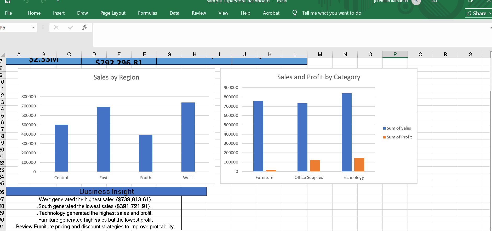

# Superstore Sales Analysis

## Project Overview
This project analyzes the Sample Superstore dataset using Microsoft Excel to uncover insights into sales, profit, orders, and regional performance.

## Objectives
- Analyze sales performance
- Identify the most profitable categories
- Compare regional performance
- Create an interactive dashboard

## Tools Used
- Microsoft Excel
- Pivot Tables
- Pivot Charts
- Slicers
- Conditional Formatting

## Key Insights
- West generated the highest sales.
- South generated the lowest sales.
- Technology had the highest sales and profit.
- Furniture had high sales but relatively low profit.
- Pricing and discount strategies should be reviewed for Furniture.

## Files
- sample_superstore.xlsx
- README.md
## Dashboard

## Files

- sample_superstore_dashboard.xlsx – Interactive Excel dashboard
- dashboard.png – Dashboard screenshot
- data/Sample - Superstore.xlsx – Original dataset

  ## Skills Demonstrated

### Technical Skills
- Microsoft Excel
- Pivot Tables
- Pivot Charts
- Dashboard Design

### Data Analysis Skills
- Data Cleaning
- KPI Development
- Data Visualization
- Business Analysis

### Professional Skills
- Analytical Thinking
- Problem Solving
- Attention to Detail

  ## Recommendations

- Review Furniture pricing and discounts.
- Increase investment in Technology products.
- Investigate the causes of low sales in the South region.

  ## Project Workflow

1. Imported the dataset.
2. Cleaned and prepared the data.
3. Created Pivot Tables.
4. Designed Pivot Charts.
5. Built an interactive dashboard.
6. Derived business insights.

   ## Author

**Pauline Mucina**

Aspiring Data Analyst passionate about using Excel, SQL, Power BI, and Python to transform data into actionable insights.

GitHub: https://github.com/paulinemuthoni27-cell

